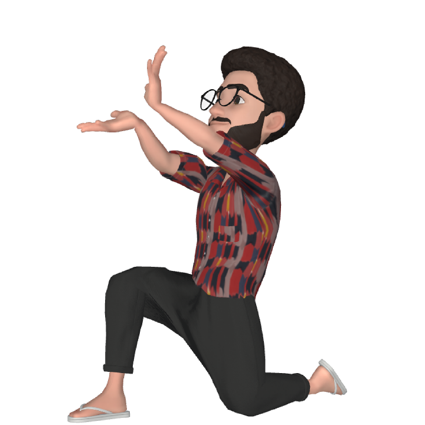

# Curso de HTML 5 e CSS 3

## Módulo 02

Exercícios realizados durante o curso de HTML e CSS (40h) ministrado pelo professor Gustavo Guanabara do canal Curso em Vídeo.

### Conteúdo:

1. Cores:
   - Psicologia das Cores.
   - Círculo Cromático: harmonização das cores.
   - Representações das cores por CSS: RGB, Hexadecimal, HSL.
   - Gradientes.
   
2. Tipografias:

   - Psicologia dos Tipos.

   - Anatomia dos Tipos.

   - Categorias das Fontes.

   - Tipos em CSS: font-style, font-weight, font-size, font-family.

   - Fontes externas.

     

3. Seletores Personalizados:
   - Id e Classes.
   - Pseudo-classes: hover, visited, active.
   - Pseudo-elementos: after, before.

4. Box-Model:
   - Tipos de Caixa: box-level, inline-level.
   - Content, padding, border, margin.
   - Box-shadow, Box-radius.

5. Grouping Tags: 
   - Header, nav, main, article, section, aside, footer.

6. Variáveis em CSS.
